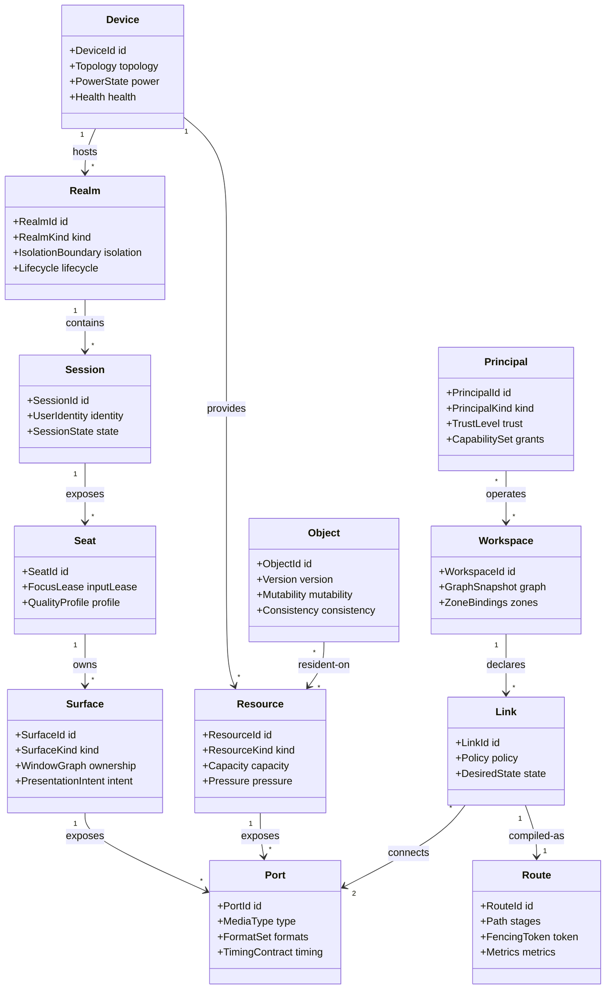

# Domain Model

The domain model prevents “user,” “machine,” “VM,” “window,” and “resource” from collapsing into one ambiguous object.

## Canonical entities



## Entity identity

Identifiers are globally unique, opaque, stable, and shared across ecosystem event contracts. Authority remains domain-specific.

```text
pf://device/main-pc
pf://realm/main-pc/win-game-vm
pf://session/main-pc/win-game-vm/koosha-console
pf://surface/main-pc/win-game-vm/ableton/main-window
pf://resource/main-pc/gpu/3090ti
pf://object/build/cargo-target/sha256:...
pf://workspace/koosha/main-desk
```

Human-readable paths are aliases, not primary keys.

## Graph layers

The same canonical entity may participate in several projections:

| Projection | Core question |
|---|---|
| Intent graph | What does the human or agent want? |
| Product graph | What requirement, feature, component, function, and test define the product? |
| Work graph | What authorized work packages and dependencies exist? |
| Execution graph | Which task/function/kernel/process is running where? |
| Data graph | Where are inputs, outputs, replicas, and durable versions? |
| I/O graph | What sources, sinks, transforms, and surfaces are connected? |
| Resource graph | What compute, memory, device, energy, and network capacity exists? |
| Evidence graph | What observations prove or disprove a requirement? |
| Economic graph | What utility, cost, risk, and opportunity compete for allocation? |

This project owns execution/data/I/O/resource projections. It references but does not own the other authorities.

## Key invariants

1. A `Realm` is not a `Principal`.
2. A `Session` is not necessarily the physical console.
3. A `Surface` does not imply process ownership or execution location.
4. A `Link` expresses intent; a `Route` expresses a concrete implementation.
5. A `Route` is valid only for one topology/capability epoch and fencing token.
6. Mutable objects have exactly one declared authority or an explicit consistency protocol.
7. Replicas and caches never silently become authoritative.
8. A resource descriptor states measured or negotiated capabilities, not marketing labels.
9. Agents may request routes and resources only through granted capabilities.
10. UI convenience never erases security, clock, data-residency, or real-time semantics.
