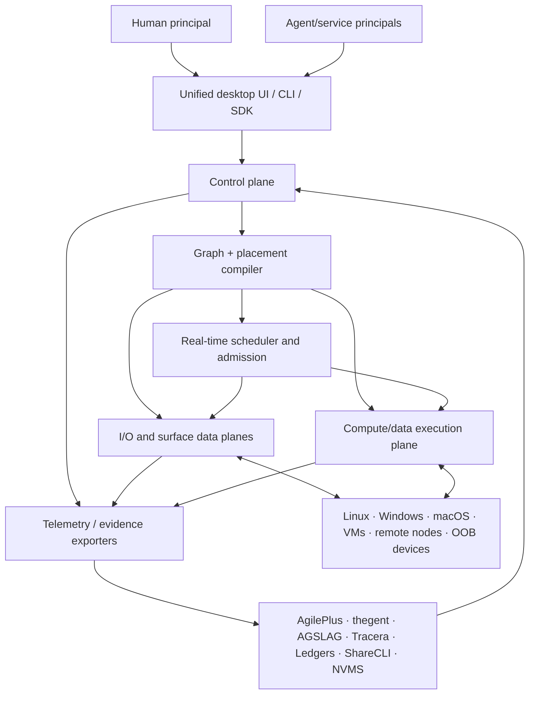

# High-Level Design

## System context



## High-level components

### 1. Product shell

One application identity, installer, workspace model, graph canvas, simple focus controls, diagnostics, and policy UI. Platform-native shells may differ, but they operate on the same object model and API.

### 2. Coordinator/control plane

Responsible for:

- identity, enrollment, capability grants;
- device/realm/session/resource registry;
- topology epochs and health;
- desired graph and workspace state;
- exclusive route leases and fencing;
- placement/route requests;
- adapter lifecycle;
- audit and evidence references.

It does not carry media or bulk object payloads.

### 3. Endpoint agent

Runs on each device/realm and exposes platform capabilities:

- process/resource inventory;
- input capture/injection;
- display/window capture and virtual displays;
- audio/MIDI endpoints;
- object/cache/storage endpoints;
- workload spawn/checkpoint/kill;
- local route execution;
- telemetry;
- fallback console descriptors.

### 4. Graph compiler

Transforms desired links and workload requests into concrete plans. It prunes candidates by security and hard constraints, then minimizes total predicted cost.

```text
desired graph
  → capability matching
  → locality-tier expansion
  → hard-constraint pruning
  → candidate stage construction
  → cost/risk prediction
  → admission control
  → prepare
  → commit with fencing
```

### 5. Real-time scheduler

Maintains RT0–Bulk service classes, resource reservations, queue discipline, deadline telemetry, and degradation policy. It coordinates with—but is not replaced by—OS schedulers and device drivers.

### 6. I/O and surface planes

Specialized adapters execute links:

- direct/shared-memory buffers;
- KVMFR/IVSHMEM;
- PipeWire/JACK/CoreAudio/WASAPI;
- evdev/uinput/libei/Raw Input/CGEvent;
- semantic application protocols;
- encoded media;
- clipboard/file/object transfer;
- virtual display/audio/HID;
- OOB KVM.

### 7. Compute/data plane

Provides:

- task/process/function/kernel descriptors;
- resource inventory;
- object identity and residency;
- placement;
- execution-region fusion/fission;
- prefetch/replication;
- checkpoint/migration/rematerialization;
- local and distributed execution adapters.

### 8. Evidence plane

Exports measurements and decision records to Tracera/SessionLedger and requirement/work IDs to AgilePlus. Raw high-rate telemetry may remain local and be summarized.

## Locality tiers

| Tier | Boundary | Preferred mechanisms |
|---|---|---|
| L0 | Same process | direct call, borrowed buffer, shared GPU command context |
| L1 | Same OS | shared memory, memfd, DMA-BUF, local IPC, PipeWire SHM, uinput |
| L2 | Same host/different realm | IVSHMEM/KVMFR, virtio/vhost, virtiofs, shared rings, virtual devices |
| L3 | Same PCIe/coherent fabric | P2P DMA, BAR apertures, GPUDirect-class paths, CXL where real |
| L4 | Same host but isolation prevents sharing | loopback transport, local codec only if required |
| L5 | Wired LAN | direct QUIC/RDMA/UCX, raw/light compression or hardware codecs |
| L6 | Routed LAN/Wi-Fi | adaptive media, pacing, FEC only when measured useful |
| L7 | WAN | congestion control, NAT traversal, relay fallback, coarse compute placement |
| L8 | Preboot/failed OS | HDMI capture, USB HID, serial/power, KVM-over-IP |

## Control/data separation

The coordinator stores metadata and intent. Payloads move peer to peer or through purpose-built relays. This prevents a central service from becoming the bandwidth, latency, and privacy bottleneck.

## Consistency

- topology, health, and telemetry: eventually consistent;
- desired workspace graph: versioned transactional updates;
- input/output ownership: strongly ordered leases with fencing;
- immutable objects: content-addressed and freely replicated;
- mutable objects: explicit authority and consistency protocol;
- audit/evidence: append-only with stable references.

## Failure behavior

- failed prepare: current route remains;
- endpoint death: route enters degraded state and eligible fallback is prepared;
- network partition: stale fencing tokens rejected; local safe mode available;
- coordinator loss: existing local routes may continue within lease/policy limits;
- adapter crash: isolated restart, no shell crash;
- hard RT admission failure: reject/degrade before activation, never silently overcommit;
- OOB path: independent management network.

## Deployment forms

1. **Single-host lab:** coordinator and endpoint on Linux host; Windows VM agent; MacBook endpoint.
2. **Home fleet:** coordinator pair, LAN peers, OOB devices, optional overlay.
3. **WAN mesh:** direct peer connections plus blind relays.
4. **Agent fleet:** transient realms and task workers, human surface publication.
5. **Enterprise/studio:** policy service, certificates, managed updates, inventory and evidence export.
