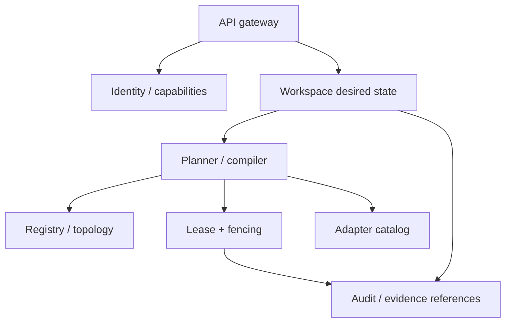

# Control Plane

## Responsibilities

The control plane:

- enrolls principals, devices, realms, and endpoint agents;
- maintains capability and topology snapshots;
- stores desired graph/workspace versions;
- validates graph patches;
- issues route/placement plans;
- operates exclusive leases and fencing;
- coordinates prepare/commit/abort;
- exposes explanations and diagnostics;
- emits audit/evidence events;
- does not carry frame/audio/object payloads.

## Service decomposition



An initial implementation may run these as modules in one daemon. The boundaries exist so RT/media payloads and privileged helpers never enter the control process.

## Registry data

Registry records are leases, not eternal facts.

```yaml
device:
  id: pf://device/main-pc
  identity_key: ...
  observed_at: ...
  expires_at: ...
  addresses: [...]
  realms: [...]
  resources: [...]
  endpoint_agent_version: ...
  health: healthy|degraded|offline
```

Capabilities include source, version, probe method, confidence, and benchmark status. “NVIDIA GPU” is not enough; the route compiler needs measured codec/P2P/copy-engine behavior.

## Workspace optimistic concurrency

Clients submit:

```text
GraphPatch(base_version=42, operations=[...])
```

The coordinator:

1. rejects if base version is stale, or returns a merge/diff;
2. validates schema and authorization;
3. computes affected links/resources;
4. compiles candidate routes;
5. obtains preparation acknowledgements;
6. commits version 43 with fencing tokens and activation boundary.

## Lease service

Leases have:

- resource ID;
- holder;
- token;
- issued/expiry time;
- renew interval;
- permitted offline continuation;
- local-priority override;
- revocation reason.

Endpoints persist only the highest applied token. Token comparison, not connection state, decides authority.

## Availability model

### Initial

- one local coordinator on the main host;
- optional warm replica on MacBook;
- signed snapshot backup;
- endpoint local-safe policies.

### Mature

- small Raft group or equivalent for desired state and leases;
- no consensus on high-rate telemetry;
- payload/data path remains independent;
- WAN partitions prefer local safe operation over ambiguous global control.

## Failure matrix

| Failure | Behavior |
|---|---|
| Coordinator process crash | Existing local routes continue per lease; shell reconnects/restarts. |
| Coordinator host crash | Replica may assume authority with higher epoch/token; endpoints reject stale host. |
| Endpoint disconnect | Mark degraded; prepare eligible fallback; do not guess surface contents. |
| Prepare timeout | Abort candidate; current route remains. |
| Commit acknowledgement loss | Retry idempotently with same token/activation ID. |
| Split network | Exclusive routes remain with current valid token until expiry/local policy; no competing token accepted. |
| Registry stale data | Planner refuses hard claim and may probe before admission. |

## Persistence

SQLite is sufficient for the first coordinator. Append-only decision/audit log and immutable workspace snapshots are retained. High-volume metrics use local time-series storage and summarized exports.

## Control-path SLO

- local query p95 under 20 ms for cached registry/workspace reads;
- graph validation p95 under 100 ms for 10,000-object graph;
- prepared focus switch control path under 50 ms p95;
- planner latency must not enter cyclic RT processing.
