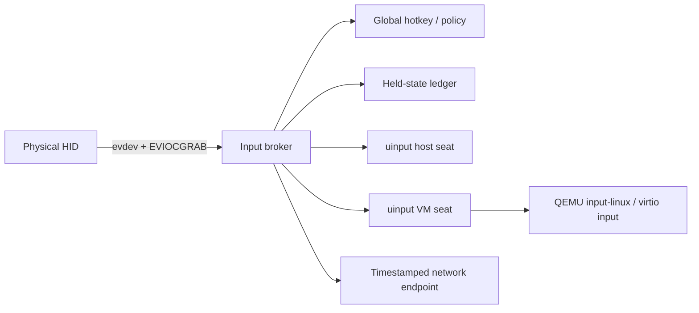

# Input and Seat Architecture

## Linux central broker

The broker, not each QEMU process, owns the physical bundle. Persistent virtual devices prevent expensive reopen/reconfiguration during focus changes.

## Focus transaction

1. validate target capability and permission;
2. snapshot held key/button/modifier state;
3. synthesize releases to old target;
4. revoke old route and increment fencing token;
5. activate new target;
6. initialize pointer/modifier mode;
7. confirm through OSD/audio cue;
8. record evidence.

## Modes

### Absolute desktop mode

- logical coordinates;
- edge barriers/portals;
- display-layout mapping;
- cursor can cross devices.

### Raw relative mode

- local cursor hidden/locked;
- movement forwarded as deltas;
- no edge switching;
- explicit escape chord;
- game/CAD/controller semantics.

### Semantic text mode

Text/IME composition is separate from raw keys. It handles dead keys, layout differences, CJK composition, emoji, dictation, and Command/Ctrl mappings.

## Platform endpoints

- Linux: uinput/libei/EIS/XTest fallback.
- Windows: Raw Input source; SendInput prototype; Virtual HID Framework path for fidelity.
- macOS: CGEvent/Event Taps; Accessibility permission; secure-input boundaries.
- Controllers: native reports/gamepad abstraction; whole USB only when required.
- Pen/touch: pressure, tilt, contact IDs, gestures, coordinate spaces.

## Hotkey defaults

Defaults are configurable and conflict-checked:

- both Ctrl: cycle input;
- both Alt: cycle output;
- combined chord: coupled seat switch;
- hold both Shift: emergency local return;
- long hold: route selector;
- dedicated raw-capture release.

A separate physical break-glass device/button may remain outside capture.

## Failure

If network/target dies, releases are synthesized locally where possible, focus returns to configured safe seat, and stale token traffic is ignored.
