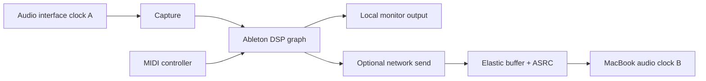

# Real-Time Audio, MIDI, and Clock Architecture

## Principle

Audio is not a side channel of video. It is a cyclic graph with sample-accurate timing, independent clocks, and explicit xrun policy.

## Node graph

The local monitor path may be RT0 while the remote monitor is RT1/RT2. Failure of the remote branch must not interrupt the local branch.

## Period budget

For sample rate `R` and buffer `N`:

\[
period = N / R
\]

At 48 kHz:

- 32 frames: 0.667 ms;
- 64 frames: 1.333 ms;
- 128 frames: 2.667 ms;
- 256 frames: 5.333 ms.

The full graph must finish before its relevant deadline with margin. Network round trips are only admitted when the topology and buffer budget permit.

## Clock domains

Two 48 kHz devices are not the same clock. The runtime estimates drift:

\[
t_g = a t_l + b
\]

and adjusts an asynchronous resampler slowly enough to avoid pitch/phase artifacts. Buffer occupancy, drift ppm, correction ratio, and xruns are exposed.

## Local Linux design

PipeWire is the default system graph; JACK semantics/compatibility are preserved for professional applications. RT threads operate on pre-established buffers and metadata in shared memory. Graph changes are prepared off-thread and swapped at safe boundaries.

## Windows design

- ASIO remains the preferred direct professional interface where available.
- WASAPI/Core Audio endpoints represent ordinary system audio.
- A bridge must not silently insert large buffers or sample-rate conversion.
- VM audio paths must be benchmarked separately from bare metal.

## macOS design

- Core Audio device clocks and aggregate-device behavior are explicit.
- MacBook speakers/mic can act as convenience endpoints, not assumed studio reference devices.
- local native apps and remote audio may be mixed through explicit graph nodes.

## Network transport

Candidates: uncompressed PCM on fast controlled LAN; low-delay codec for constrained/WAN; NetJACK2/JackTrip/AES67/Dante-class adapters where appropriate.

Rules:

- audio transport is paced independently of video;
- retransmission is bounded by deadline;
- packet timestamps reference source clock;
- concealment is explicit;
- WAN professional live monitoring is not admitted without measured budget.

## MIDI/control

MIDI and OSC carry event timestamps and origin. Raw USB forwarding is a fallback for devices whose proprietary protocol cannot be represented.

## RT isolation

- dedicated CPU/core affinity where practical;
- priority and memory locking;
- prefaulted buffers;
- no logging/allocations in callback;
- storage/network background caps;
- plugin/JIT warm-up before performance;
- GPU and DPC/ISR pressure monitored on Windows.

## Acceptance

Zero-xrun claims require a declared project/plugin load, sample rate, buffer, interface, topology, duration, and concurrent adversarial workload.
