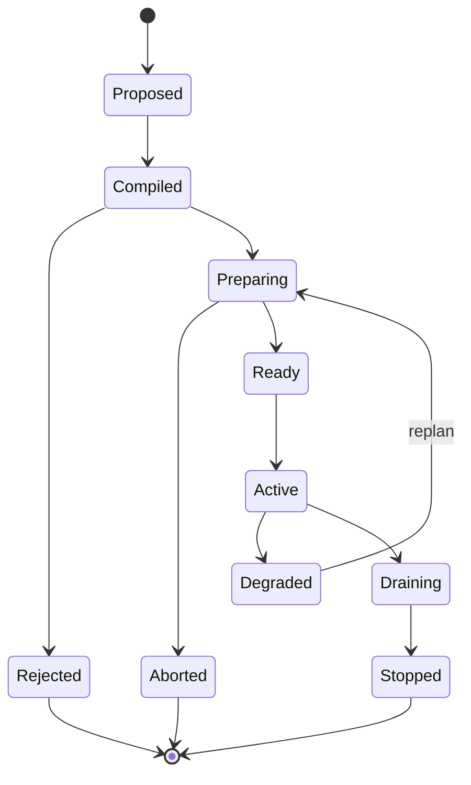
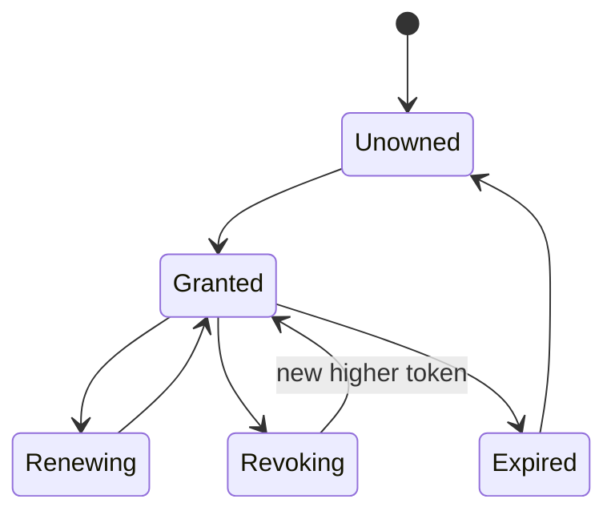
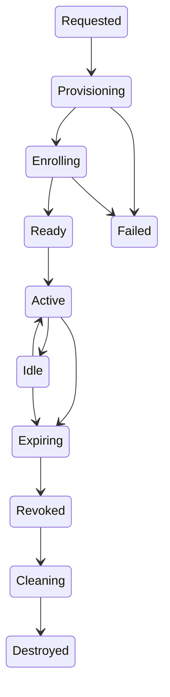

# State Machines

## Route lifecycle



## Exclusive focus lease



Endpoint invariant: `token < lastAppliedToken` is rejected.

## Realm lifecycle



## Object lifecycle

```text
declared → materializing → resident → replicated/cached
→ pinned/consumed → evictable → spilled/evicted
→ restored or garbage-collected
```

Authority and durable-copy checks gate deletion.

## Workspace activation

```text
load snapshot
→ diff current desired graph
→ authorize
→ compile affected routes
→ admission
→ prepare
→ atomic commit
→ drain old routes
→ persist evidence
```

Activation is idempotent by workspace version and transaction ID.
