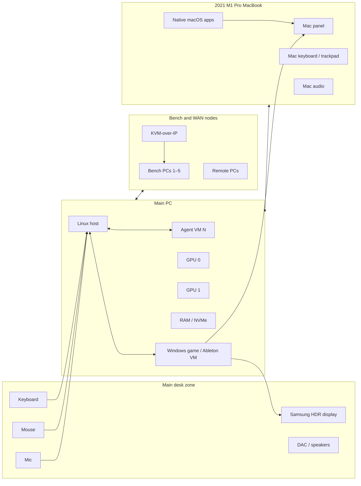

# System Context and Plane Model

## User-visible computer



This visual does not imply one transport. Each edge is a desired relationship compiled against topology and policy.

## Plane separation

### Intent plane

Human and agents declare desired outcomes, quality, constraints, budgets, and workspace state.

### Control plane

Authenticates, records desired graph, inventories capabilities, issues leases, coordinates preparation/commit, and records decisions.

### Real-time I/O plane

Executes cyclic/interactive media and input schedules. It must not block on control logic.

### Compute execution plane

Runs admitted tasks/regions on CPU/GPU/NPU/other resources.

### Data/object plane

Tracks object authority, versions, residency, cache, prefetch, transfer, and spill.

### Evidence plane

Correlates topology, route/placement decision, metrics, artifacts, and requirement/work IDs.

## Dependency direction

```text
Human/AGSLAG constraints
        ↓
AgilePlus authorized work
        ↓
thegent / ShareCLI workload request
        ↓
Fabric compiler and admission
        ↓
local/remote execution + I/O
        ↓
SessionLedger / Tracera evidence
```

No lower plane may silently reinterpret a higher-plane decision. The fabric may reject or degrade an impossible request, but must report why.

## Topology epoch

Every plan is bound to:

```yaml
topology_epoch:
  id: 1842
  created_at: 2026-08-28T...
  devices_hash: sha256:...
  routes_hash: sha256:...
  capability_probe_versions:
    linux-main: "pf-probe/0.1"
    win-vm: "pf-probe/0.1"
    macbook: "pf-probe/0.1"
```

Hotplug, driver reset, sleep/wake, network path change, display mode change, or permission revocation may create a new epoch. Existing routes continue only if their capabilities remain valid.

## Authority boundaries

| State | Authority |
|---|---|
| Desired workspace graph | Coordinator/workspace authority |
| Active exclusive input route | Lease authority + endpoint fencing |
| Surface/window ownership | Source realm |
| Local platform permission | Operating system |
| Object version/authority | Object owner or declared consistency service |
| Resource availability | Endpoint agent measurement |
| Work priority/budget | AGSLAG/AgilePlus/thegent input contract |
| Evidence links | Tracera |
| Session history | SessionLedger |
