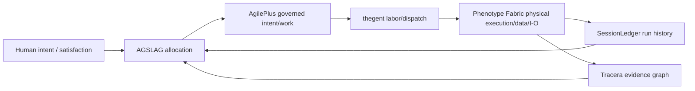

# Ecosystem Authority and Product Boundaries

## Operating loop

## Authority table

| Product | Owns | Does not own |
|---|---|---|
| AGSLAG | portfolio/economic allocation, project continuation/termination, capital/compute budgets | task execution, physical routing, evidence truth |
| AgilePlus | requirements, specs, modules, work packages, acceptance/governance contracts | worker process lifecycle, hardware placement, runtime object state |
| thegent | labor plans, agent/worker dispatch, retries, execution intent | physical device topology, media routes, canonical requirement/evidence graph |
| Phenotype Fabric | resource/capability inventory, route plans, execution placement, object residency, interactive seats/surfaces | why a project exists, project acceptance policy, long-term evidence interpretation |
| Tracera | requirement→decision→run→artifact→evidence links and impact graph | live scheduler state, task queue, portfolio value |
| SessionLedger | durable operational/session/run history and replay bundles | canonical requirement semantics or physical placement authority |
| ShareCLI | standalone OS-adjacent agent/process supervisor, host pressure/coalescing and declarative process UX | enterprise allocation, universal graph authority, cross-product evidence ownership |
| NVMS | runtime/realm/device inventory boundary or predecessor substrate, depending consolidation decision | intent/governance/evidence ownership |
| ResearchLedger | external research sources, claims, confidence and research decisions | live runtime telemetry |
| RepoLedger | software/repository inventory and state | physical hardware/resource authority |
| hwLedger | hardware assets, acquisition/capability/cost history | live route or task scheduling |
| labs-compute | bounded experiments in kernels, local inference and device mesh | stable product contracts until graduation |

## Integration rule

Products share stable identifiers, typed event envelopes and explicit APIs. They do **not** share one writable database, one giant ontology or implicit table access. A product can cache another product’s view but must preserve the source authority and version.

## Fabric boundary test

A feature belongs in Fabric when it answers one of:

- what resource, object, route or endpoint exists now;
- how an interactive/data/compute graph should execute physically;
- which locality/transport is valid and cheapest;
- how to preserve a real-time/security/quality constraint during execution;
- how to recover or replan when a physical/runtime path fails.

It does not belong when the primary question is project strategy, work authorization, agent organizational design, evidence interpretation or historical knowledge management.
