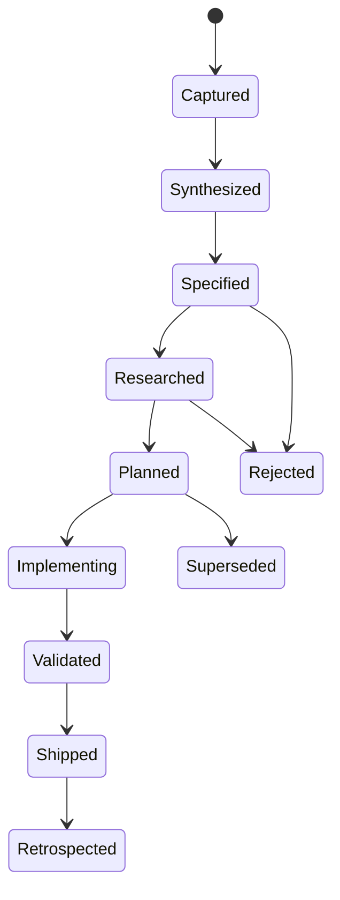

# Governance

## Decision authority

| Decision | Owner | Required evidence |
|---|---|---|
| Human product intent | User / AGSLAG-facing owner | Intent record and explicit constraints |
| Requirements and acceptance | AgilePlus | Traceable FR/NFR, governance contract, evidence plan |
| Agent/labor dispatch | thegent | Authorized work package and resource policy |
| Runtime placement and routing | Phenotype Fabric | Topology snapshot, cost model, capability grants, telemetry |
| Process supervision/coalescing | ShareCLI when delegated | Local policy, health, pressure, process identity |
| Operational history | SessionLedger | Signed event stream and artifacts |
| Cross-artifact trace links | Tracera | Evidence contracts and immutable references |
| Economic resource priority | AGSLAG | Utility, cost, risk, opportunity, owner satisfaction |
| Experimental mechanism graduation | labs-compute review | Reproducible benchmark, user-facing demo, stable API |

## Specification lifecycle

## Evidence rule

No feature may be described as “working,” “zero-copy,” “hard real-time,” “HDR-preserving,” “transparent,” “atomic,” or “seamless” based only on architecture intent.

Each such claim requires:

- exact topology and software versions;
- measurement boundary;
- workload and concurrent-load description;
- p50, p95, p99, and worst observed result;
- failure and degradation behavior;
- reproducible scripts/configuration;
- raw evidence artifact;
- requirement IDs covered;
- source/clock synchronization method where relevant.

## ADR rule

An ADR is required when a decision:

- changes product authority or repository boundaries;
- chooses a control/data-plane protocol;
- creates a platform-specific privileged component;
- changes consistency, security, or real-time semantics;
- creates vendor lock-in;
- rejects a plausible architecture;
- changes the meaning of an existing public claim.

## Research rule

A research item must state:

- hypothesis;
- null hypothesis;
- minimum useful result;
- falsification condition;
- baseline alternatives;
- variables and controls;
- expected transfer/coordination tax;
- retention or deletion decision after the experiment.

## Supersession

Documents are append-only in history but mutable in the working tree. Superseded documents remain linked from indexes with:

- superseding document ID;
- date;
- reason;
- affected requirement and work-package IDs;
- migration action.

## Security review triggers

Mandatory security review is triggered by:

- kernel or driver installation;
- input capture/injection;
- screen or audio capture;
- virtual display/audio/HID creation;
- cross-realm shared memory;
- remote wake/power or KVM-over-IP;
- credential, clipboard, file, USB, microphone, or camera forwarding;
- agent-created realms;
- WAN relay or NAT traversal;
- arbitrary code or syscall interposition.

## Definition of done

A work package is done only when its acceptance criteria, compatibility matrix, benchmark/fault tests, security controls, documentation, and rollback path are all evidenced. “Code exists” is not completion.
