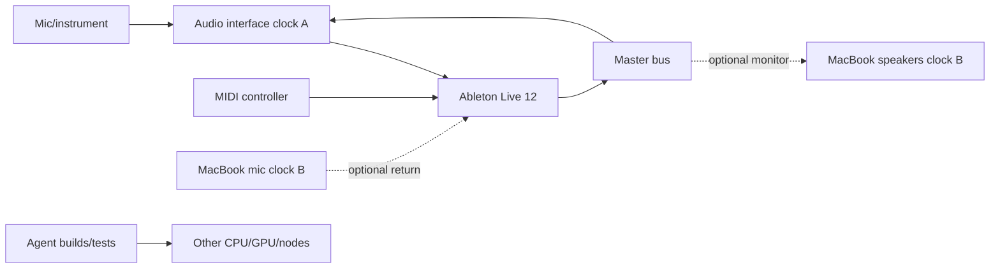

# Scenario: Ableton Live 12 Suite Protected Real-Time Island

## Graph

## Hard constraints

- the local interface/Ableton path is RT0;
- callback threads and required memory stay resident and avoid dynamic control work;
- admitted buffer/rate/project fingerprint is explicit;
- background CPU/GPU/storage/network work cannot overcommit the island;
- remote monitor or DSP nodes have their own clock domain, timestamping, elastic buffer and ASRC;
- a remote DSP node is admitted only if its two-way graph deadline fits with margin;
- recording authority never silently moves to an unproven remote path.

## User-visible modes

- `creator-local`: local interface and monitors, remote surfaces only.
- `creator-couch-monitor`: Ableton stays on main PC; Mac shows window and receives a monitor stream; controls return timestamped.
- `creator-remote-dsp-preview`: selected look-ahead/plugin nodes may use another host after explicit admission.
- `creator-safe`: all nonessential routes removed and background workloads evacuated/throttled.

## Failure

On network/remote-node failure, optional monitor/DSP nodes drop or bypass according to the project policy. The local recording/monitor path continues if it was admitted as authoritative.
