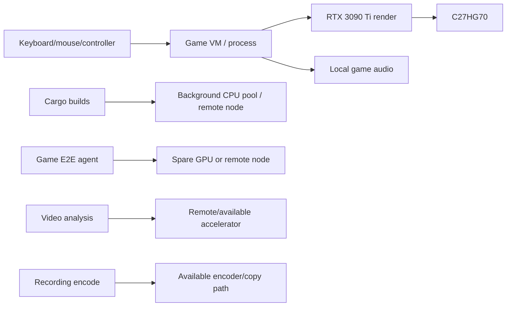

# Scenario: Gaming Under Background Agent Load

## Intent

Play at the best valid high-refresh/HDR mode while agents build code, run tests and perform inference. Background throughput is valuable but cannot create frame/input spikes beyond the gaming profile.

## Runtime graph

## Scheduler rules

- game input/render/audio are RT1/RT2 and remain local unless the whole game is intentionally streamed;
- shader compilation, asset preprocessing, test instances, recording and vision analysis are independent candidate regions;
- CPU affinity, GPU engine occupancy, memory bandwidth, PCIe copies, encoder sessions and thermal headroom enter admission;
- if the render GPU approaches the frame-time risk threshold, agent GPU work moves, pauses or falls to a lower service class;
- bulk transfers throttle before frame queues grow;
- HDR and refresh degrade only through the declared gaming ladder and are shown to the user.

## Required evidence

Frame-time distribution, input-to-photon, frame age, encoder/copy/GPU occupancy, background completion impact and every scheduler relocation are captured together. Average FPS alone is rejected.
