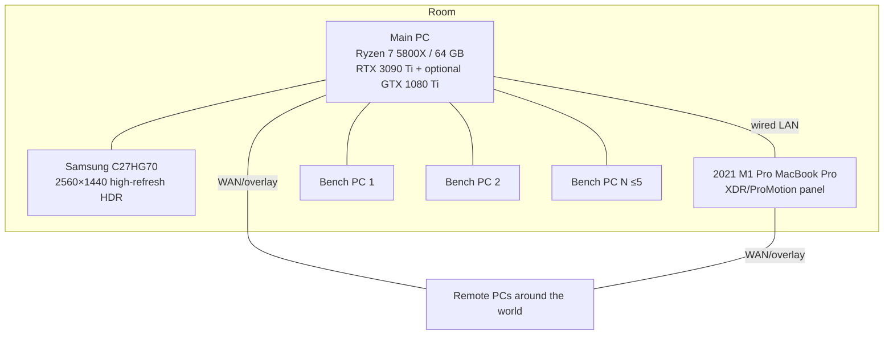

# Reference User Environment

## Physical topology

## Logical topology

Main PC is not one logical PC. It contains a Linux host and one or more VM/realm seats, including a Windows GPU-passthrough realm. The MacBook may be:

- an independent macOS realm;
- the current keyboard/trackpad/microphone seat;
- a full-screen remote monitor sink;
- a third extended display for a main-PC realm;
- a native host for proxy windows representing remote applications;
- an available CPU/GPU/ANE node only when placement cost and platform support make that useful.

Bench and remote systems expose normal software paths when healthy and OOB paths where required.

## Workload topology

Foreground may be:

- a high-refresh HDR game;
- Ableton Live 12 Suite with live monitoring and MIDI;
- ordinary development or desktop work.

Background agents may compile Rust, run inference, create VMs, run a game for E2E tests, capture/inspect video, transfer artifacts or execute arbitrary tools. The scheduler treats this as the normal case, not a stress-test exception.
