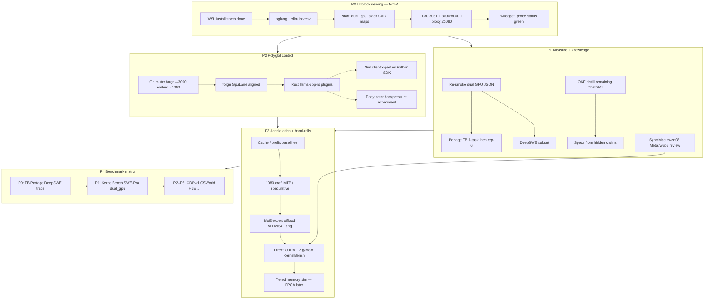

# Polyglot dual-GPU forward DAG — 2026-07-17

Status: **P0 in progress** — 3090 OK (driver 620.02); 1080 PnP Error; torch/sglang cu130 OK; **SGLang :8000 blocked on CUDA_HOME/nvcc PATH** (fix in `start_dual_gpu_stack.ps1`, relaunch pending). See [P0 stack audit](../2026-07-17-p0-stack-audit/INDEX.md).

Hardware: **GTX 1080 Ti (11 GB)** helper + **RTX 3090 Ti (24 GB)** primary.

Prefs: `docs/PYTHON_PREF.md` — **3.14t + direct CUDA + Zig/Mojo hand-rolls**; Nim/Pony = scoped x-perf experiments.

## Polyglot map (short)

| Role | Lang |
|------|------|
| Serve / eval glue | Python **3.14t** (3.10 temporary) |
| Engines | C/C++ llama.cpp, SGLang/vLLM |
| Hand-roll kernels | **CUDA**, **Zig**, **Mojo** |
| Agent harness | Rust forgecode-fork |
| Supervisor | Go |
| Eval | **Portage** fork |
| Fleet manager | hwLedger (+ probe now) |
| x-perf clients | **Nim** (HTTP client) |
| x-perf orchestration | **Pony** (actors, out-of-process LLM only) |
| Mac | Metal/wgpu/omlx + review tool from Mac sync |

## Full forward DAG

## Overall next steps (ordered)

1. **Finish WSL stack** — wait for SGLang/vLLM; confirm `~/.pheno-serve-venv`; prefer rebuild on **3.14t** when available  
2. **`hwledger_probe.py up` / `start_dual_gpu_stack.ps1`** — 8081 + 8000 + 21080 healthy  
3. **Portage dogfood** — 1-task terminus against local Qwen; then representative-6  
4. **Mac sync** — push `mac/qwen08-metal-review-*` (Zig/Mojo/Metal/wgpu review tool)  
5. **Hand-roll lane** — KernelBench RTX3090 via forge + direct CUDA; optional Zig/Mojo microbench  
6. **x-perf side quests** — Nim client latency/RSS; Pony mailbox sim (HTTP out)  
7. **OKF** — finish high-value ChatGPT distill (Deterministic Cache, Compression, Feature graph)  
8. **Scoreable locks** — only after Portage + engines green  

## Parallel now

| Lane | Status |
|------|--------|
| WSL torch→sglang | **cu130 + sglang 0.5.15.post1 OK**; `:8000` needs CUDA_HOME relaunch |
| 1080 llama-server | **BLOCKED** — PnP Error (3090-only mode) |
| Portage CLI 0.1.42 | READY (uses Podman through Portage's Docker-compatible contract) |
| forge GpuLane indices | FIXED |
| OKF / plans | **P0 audit packet added** `plans/2026-07-17-p0-stack-audit/` |
| Mac review tool | blocked on Mac push |
| Nim/Pony experiments | after P0 endpoints up |

## Install note

Disk gate uses WSL `$HOME`. NOPASSWD set for `kooshapari`. Python fallback 3.10 is temporary — **3.14t preferred**.
