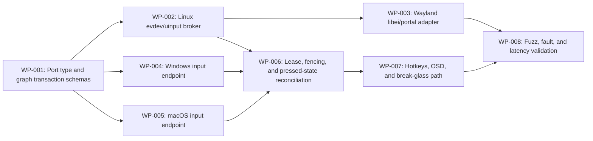

# Plan: Universal I/O Graph, Seats, and Focus

> **Inputs:** [`spec.md`](spec.md), [`tasks.md`](tasks.md), top-level PRD/HLD/LLD, and the intent source.  
> **Status:** Planned.  
> **Planning rule:** architecture and research tasks produce evidence before broad implementation claims.

## Phase Map

| Phase | Goal | Deliverables | Exit Gate |
|---|---|---|---|
| P0 — Baseline | Pin versions, topology, claims, and current alternatives. | Inventory, source register, benchmark baseline. | Baseline reproducible on reference topology. |
| P1 — Contracts | Define schemas, APIs, states, and security/authority boundaries. | Reviewed contracts and ADRs. | Schema validation and simulator tests pass. |
| P2 — Vertical slice | Implement the smallest end-to-end path. | Working reference scenario. | Route/workload operates with evidence. |
| P3 — Hardening | Add failure, contention, compatibility, and security handling. | Fault tests, load tests, diagnostics. | Acceptance gates pass under adversarial load. |
| P4 — Packaging | Integrate shell, installer, operations, and ecosystem events. | Packaged feature and evidence bundle. | Clean install/upgrade/rollback succeeds. |

## Work Package DAG

| WP ID | Description | Depends On |
|---|---|---|
| WP-001 | Port type and graph transaction schemas | — |
| WP-002 | Linux evdev/uinput broker | WP-001 |
| WP-003 | Wayland libei/portal adapter | WP-002 |
| WP-004 | Windows input endpoint | WP-001 |
| WP-005 | macOS input endpoint | WP-001 |
| WP-006 | Lease, fencing, and pressed-state reconciliation | WP-002, WP-004, WP-005 |
| WP-007 | Hotkeys, OSD, and break-glass path | WP-006 |
| WP-008 | Fuzz, fault, and latency validation | WP-003, WP-007 |

**Critical path:** WP-001 → WP-002 → WP-006 → WP-007 → WP-008

## Parallelization

Work packages may fan out only after their contract dependency is accepted. Platform adapters can run in parallel, but integration and evidence gates remain shared. Research agents may test competing mechanisms concurrently; implementation agents may not independently mutate the same authority/schema.

## PERT Envelope

| Phase | Optimistic | Most likely | Pessimistic | Expected `(O+4M+P)/6` |
|---|---:|---:|---:|---:|
| P0 | 2 agent-days | 4 | 8 | 4.3 |
| P1 | 4 | 8 | 16 | 8.7 |
| P2 | 8 | 18 | 36 | 19.3 |
| P3 | 10 | 24 | 50 | 26.0 |
| P4 | 5 | 12 | 24 | 12.8 |

These are planning units, not delivery promises. Hardware/driver signing, multi-OS compatibility, and research uncertainty dominate the pessimistic tail.

## Exit Gates

1. No unresolved P0 security or correctness risk.
2. All claimed paths have a measured fallback.
3. Performance is tested while foreground and background workloads contend.
4. Every acceptance claim names its measurement boundary.
5. Documentation, configuration, rollback, and evidence are part of the feature.
