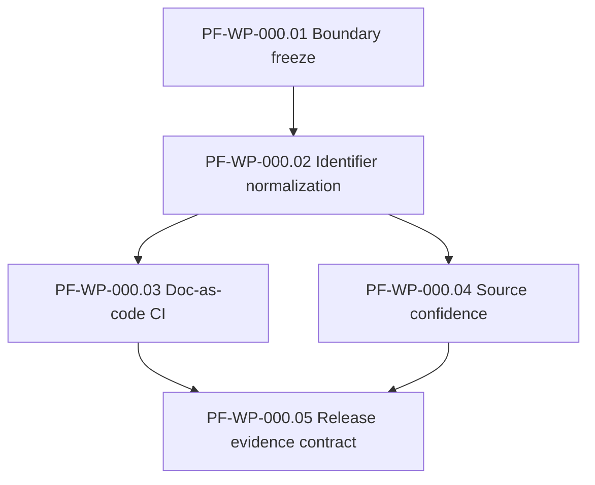

# Plan: Fabric Program Baseline (R0 Foundation)

> **Inputs:** [`spec.md`](spec.md), [`tasks.md`](tasks.md), top-level
> PRD/HLD/GOVERNANCE/SPECIFICATION, `ecosystem/boundaries.md`,
> `ecosystem/event-contracts.json`, `research/source-register.md`.
>
> **Status:** Planned.
> **Planning rule:** every release-promotion claim produces evidence
> before the promotion is marked done. This WP produces zero
> performance claims — it is a contracts and CI work package.

## Phase Map

| Phase | Goal | Deliverables | Exit Gate |
|---|---|---|---|
| P0 — Inventory | Catalog existing identifiers and boundary claims | Identifier inventory + boundary table | Inventory reproducible from current archive |
| P1 — Contracts | Author program/boundaries.json, identifiers.md, source-status.md, release-evidence-contract.md | 4 contract files | All 4 files pass JSON/MD validation |
| P2 — CI | Author doc-checks.yml and program/scripts/ | GitHub Action + extracted scripts | Action runs green on current archive |
| P3 — Hardening | Add expected-breakage fixes; strict mode for doc-checks | All doc-checks clean in strict mode | Build fails on introduced breakage |

## Work Package DAG

| WP ID | Description | Depends On |
|---|---|---|
| PF-WP-000.01 | Freeze product boundary and authority map | — |
| PF-WP-000.02 | Normalize identifier scheme | PF-WP-000.01 |
| PF-WP-000.03 | Establish documentation-as-code CI checks | PF-WP-000.02 |
| PF-WP-000.04 | Create source confidence and claim policy | PF-WP-000.02 |
| PF-WP-000.05 | Define release evidence contract | PF-WP-000.03, PF-WP-000.04 |

## Acceptance for Plan

The plan is accepted when the GitHub Action defined in PF-WP-000.03
runs green on the current `phenotype-fabric` archive and the
release-evidence-contract.md template references every existing
verification artifact (benchmark-catalog.json, fault-catalog.json,
compatibility-matrix.md, threat-model.md).

## Cross-references

- `GOVERNANCE.md#evidence-rule` — the evidence rule this WP
  operationalizes
- `ecosystem/boundaries.md` — source of truth for adjacency
- `work/build-order.md` — R0 gate
- `meta/PHENOTYPE_ARCHITECTURE.md` (in repos/meta/) — cross-repo
  authority map this WP contributes to

## Out of Scope for This Plan

- No runtime code
- No new product behavior
- No spec content changes to specs 001–012
- No change to `work/tasks.json` semantics (only formatting)
