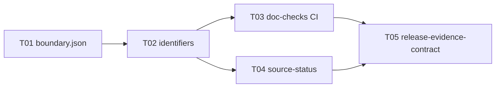

# Tasks: Fabric Program Baseline (R0 Foundation)

## Task Rules

- Every task references a work package and requirement IDs.
- Implementation tasks begin only after their governing contract task.
- "Research" tasks must retain raw results and a falsification conclusion.
- No task may mark a release gate complete from an idle-host demo alone.
- This WP contains **no** runtime code tasks. All tasks are docs,
  schemas, or CI workflows.

## Task Catalog

| Task ID | WP | Task | State | Requirement traces |
|---|---|---|---|---|
| PF-WP-000.01 | WP-013 | Author `program/boundaries.json` and cross-link from `ecosystem/boundaries.md` | Planned | PF-FR-098 |
| PF-WP-000.02 | WP-013 | Author `program/identifiers.md` and add `TASK-NNN` + `requirement_traces` fields to `work/tasks.json` | Planned | PF-FR-098 |
| PF-WP-000.03 | WP-013 | Author `.github/workflows/doc-checks.yml` + extract `program/scripts/` (JSON, proto, OpenAPI, manifest, link) | Planned | PF-FR-098 |
| PF-WP-000.04 | WP-013 | Author `research/source-status.md` with 14 SOTA + 8 research hypotheses classified | Planned | PF-FR-099 |
| PF-WP-000.05 | WP-013 | Author `work/release-evidence-contract.md` template + reference from `work/release-plan.md` | Planned | PF-FR-098, PF-FR-099 |

## Definition of Done (per task)

- **PF-WP-000.01**: `program/boundaries.json` exists, parses, contains
  the 12 in-scope specs + 13 adjacent products + this WP and the next.
  `ecosystem/boundaries.md` references it.
- **PF-WP-000.02**: `program/identifiers.md` exists, lists the 5 ID
  schemes with example ranges. `work/tasks.json` has every entry with
  both `id: TASK-NNN` and `wp: PF-WP-NNN.NN` fields. `check_identifiers.py`
  exits 0.
- **PF-WP-000.03**: GitHub Action runs on every push and PR, executes
  the 5 checks, and is green on the current archive. Action is
  initially `continue-on-error: true` to allow incremental cleanup.
- **PF-WP-000.04**: `research/source-status.md` has 14+ rows from
  `sota/` and 8+ rows from `research/hypotheses.md`, each with
  a confidence value. Cross-link to TASK-NNN for any cited
  performance claim.
- **PF-WP-000.05**: `work/release-evidence-contract.md` template has
  6 sections (architecture, performance, failure, security,
  compatibility, rollback) and is referenced from `work/release-plan.md`
  as the R0 → R1 gate.

## Cross-task Dependencies

## Exit Gate

The R0 release channel is unlocked when all 5 tasks above are Done AND
`work/build-order.md` is updated to mark PF-WP-000 as Done. This WP must
be Done before PF-WP-010 begins coding.
