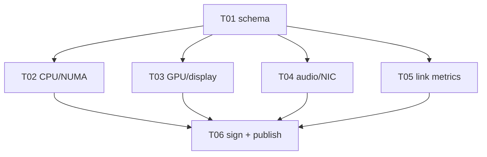

# Plan: Capability Inventory and Topology Probe

> **Inputs:** [`spec.md`](spec.md), [`tasks.md`](tasks.md),
> `SPECIFICATION.md`, `HLD.md`, `LLD.md`, `verification/capability-*` (to
> be authored), `research/literature-map.md`.
>
> **Status:** Planned.
> **Planning rule:** every probe claims its budget (cold/warm/full
> latency) with evidence on the reference environment. The
> compatibility matrix must show the descriptor is byte-stable across
> reboots.

## Phase Map

| Phase | Goal | Deliverables | Exit Gate |
|---|---|---|---|
| P0 — Schemas | Lock the descriptor + signature schemas | `architecture/schemas/capability-descriptor-v1.json` + sig schema | jsonschema validation passes |
| P1 — Small probe | CPU/NUMA/cache/memory probe | Rust impl in `crates/fabric-capability/src/probe/cpu.rs` | Cold < 100ms, warm < 1ms on reference |
| P2 — Hardware probe | GPU/NPU/codec/display/PCIe + audio/MIDI/input/storage/NIC | `probe/{gpu,display,pcie,audio,input,storage,nic}.rs` | Descriptor is populated end-to-end |
| P3 — Link probe | RTT/jitter/loss/bandwidth + copy-path classifier | `probe/link.rs` | All 8 copy paths classified per edge |
| P4 — Sign + publish | Ed25519 signing + local/LAN/WAN delta channels | `sign.rs`, `publish.rs` | Tampered descriptor rejected |
| P5 — Adapter | Go reference adapter + C FFI shim | `cmd/capprobe`, `crates/fabric-capability-ffi/` | Adapter round-trips a descriptor |

## Work Package DAG

| WP ID | Description | Depends On |
|---|---|---|
| PF-WP-010.01 | Define capability descriptor schemas | PF-WP-000.02 (identifiers) |
| PF-WP-010.02 | Probe CPU/NUMA/cache/memory | PF-WP-010.01 |
| PF-WP-010.03 | Probe GPU/NPU/codec/display/PCIe | PF-WP-010.01 |
| PF-WP-010.04 | Probe audio/MIDI/input/storage/NIC | PF-WP-010.01 |
| PF-WP-010.05 | Measure link metrics + classify copy paths | PF-WP-010.01 |
| PF-WP-010.06 | Sign + publish descriptor deltas | PF-WP-010.02, PF-WP-010.03, PF-WP-010.04, PF-WP-010.05 |

## Acceptance for Plan

The plan is accepted when:
1. The descriptor schema is committed and validates.
2. Each probe function has a unit test that asserts the descriptor is
   populated for a stub (mock) environment.
3. The reference-environment evidence files are committed.
4. The Go adapter round-trips a descriptor via the C FFI.

## Cross-references

- `003-compute-data-fabric` (spec) — consumes the descriptor
- `004-locality-route-compiler` (spec) — consumes link metrics
- `architecture/schemas/capability-descriptor-v1.json` (this WP)
- `architecture/schemas/event.proto` — descriptor-delta event type
- `ecosystem/event-contracts.json` — descriptor-delta event schema

## Out of Scope for This Plan

- Route planning (PF-WP-020)
- Placement optimization (PF-WP-030)
- Authorization of capabilities (spec 009)
- Dynamic re-probing daemon (PF-WP-080 or later)
- macOS / Windows probes (R1+)
