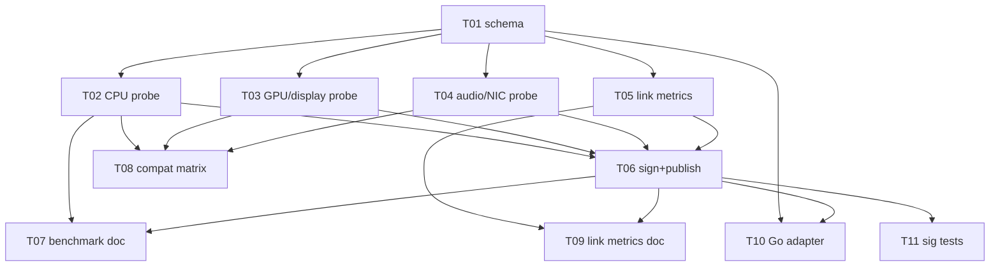

# Tasks: Capability Inventory and Topology Probe

## Task Rules

- Every task references a work package and requirement IDs.
- Implementation tasks begin only after PF-WP-010.01 (schema) is done.
- "Research" tasks must retain raw results and a falsification conclusion.
- No task may claim a latency budget without a `cargo bench` or equivalent
  measurement on the reference environment.
- Platform-specific code includes uninstall/rollback and permission-denial
  tests (probe must fail gracefully when run as non-root on Linux).

## Task Catalog

| Task ID | WP | Task | State | Requirement traces |
|---|---|---|---|---|
| PF-WP-010.01 | WP-014 | Define and validate `architecture/schemas/capability-descriptor-v1.json` + signature schema | Planned | PF-FR-007 |
| PF-WP-010.02 | WP-014 | Implement CPU/NUMA/cache/memory probe (`probe/cpu.rs`) + benchmark | Planned | PF-FR-007, PF-FR-008 |
| PF-WP-010.03 | WP-014 | Implement GPU/NPU/codec/display/PCIe probe (`probe/gpu.rs`, `probe/display.rs`, `probe/pcie.rs`) | Planned | PF-FR-007, PF-FR-008 |
| PF-WP-010.04 | WP-014 | Implement audio/MIDI/input/storage/NIC probe (`probe/audio.rs`, `probe/input.rs`, `probe/storage.rs`, `probe/nic.rs`) | Planned | PF-FR-007, PF-FR-008 |
| PF-WP-010.05 | WP-014 | Implement link metrics probe + copy-path classifier (`probe/link.rs`) | Planned | PF-FR-009 |
| PF-WP-010.06 | WP-014 | Implement Ed25519 signing + local/LAN delta publication (`sign.rs`, `publish.rs`) | Planned | PF-FR-007, PF-FR-008 |
| PF-WP-010.07 | WP-014 | Author `verification/capability-benchmark.md` with cold/warm/full latency | Planned | PF-FR-008 |
| PF-WP-010.08 | WP-014 | Author `verification/capability-compatibility-matrix.md` listing stable descriptor hardware | Planned | PF-FR-007 |
| PF-WP-010.09 | WP-014 | Author `verification/capability-link-metrics.md` with measurement methodology + sample results | Planned | PF-FR-009 |
| PF-WP-010.10 | WP-014 | Build Go reference adapter (`cmd/capprobe/`) + C FFI shim (`fabric-capability-ffi/`) | Planned | PF-FR-007 |
| PF-WP-010.11 | WP-014 | Author `verification/capability-signature-tests.md` — tampered descriptor rejection evidence | Planned | PF-FR-007 |

## Definition of Done (per task)

- **PF-WP-010.01**: JSON schema exists, parses, and validates a known-good
  descriptor fixture. `jsonschema` CLI confirms it. Rust `schemars` generates
  a typed struct from it.
- **PF-WP-010.02**: `cargo test -p fabric-capability cpu` passes. Cold probe
  < 100ms, warm < 1ms measured with `criterion`. Results committed to
  `verification/capability-benchmark.md`.
- **PF-WP-010.03**: On reference environment (NVIDIA + Wayland), GPU/display
  blocks are populated. On systems without NVIDIA, the probe returns
  `Unknown` per vendor and does not panic.
- **PF-WP-010.04**: All 4 sections are populated on reference environment.
  Missing device types (no MIDI, no gamepad) return empty arrays, not errors.
- **PF-WP-010.05**: All 8 copy-path classes (L0–L7) are represented in the
  output for the reference topology. No unclassified edges.
- **PF-WP-010.06**: Tampering with any field of the descriptor invalidates the
  signature. `cargo test -p fabric-capability signature` passes.
- **PF-WP-010.07**: Benchmark document exists with p50/p95/p99/worst cold and
  warm latencies, exact topology + software versions, workload description,
  and measurement boundary. File is in `verification/`.
- **PF-WP-010.08**: Compatibility matrix lists at least the reference
  environment hardware. Any hardware known to produce unstable descriptors
  is marked `unstable`.
- **PF-WP-010.09**: Link metrics document exists with p50/p95/p99/worst RTT,
  jitter, loss, bandwidth per edge. Copy path classification is shown for
  each edge.
- **PF-WP-010.10**: `go run ./cmd/capprobe/...` prints a valid, signed
  descriptor JSON for the current machine. Round-trips via the C FFI without
  data loss.
- **PF-WP-010.11**: Signature test document shows the tampered descriptor
  is rejected at the verifier boundary. Covers: modified field, expired key,
  wrong key.

## Cross-task Dependencies

## Exit Gate

PF-WP-010 is Done when all 11 tasks above are Done, the reference
environment produces a stable signed descriptor, and `work/build-order.md`
is updated to mark PF-WP-010 as Done. This unlocks PF-WP-020
(route compiler).
