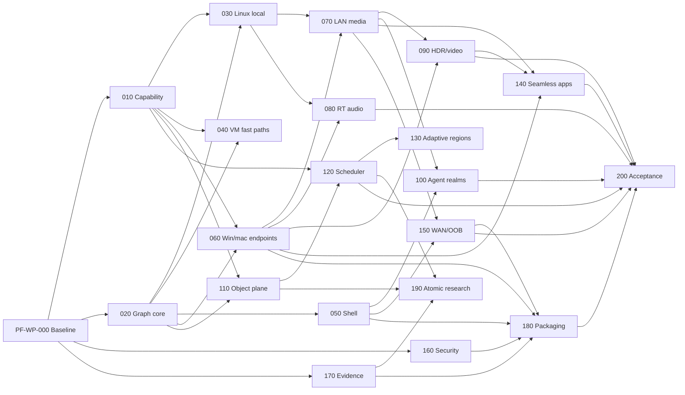

# Program Dependency DAG

## Parallel lanes

- Graph core, capability inventory, security and evidence begin after the documentation baseline.
- Linux local paths, VM fast paths, shell UX and Windows/macOS endpoints can overlap once their contracts stabilize.
- RT audio and HDR/video are independent specialist lanes sharing endpoint and telemetry contracts.
- Object plane/scheduler can progress without seamless-window completion.
- Atomic interposition is deliberately off the release critical path.

## Forbidden shortcuts

- Packaging cannot wait until the end; clean-machine skeletons start early even though final gate depends on later components.
- Pixel-proxy work cannot bypass semantic-protocol research.
- Adaptive scheduling cannot precede a measured explicit TaskSpec baseline.
- A UI demo cannot mark a transport complete without mixed-load and fault evidence.
